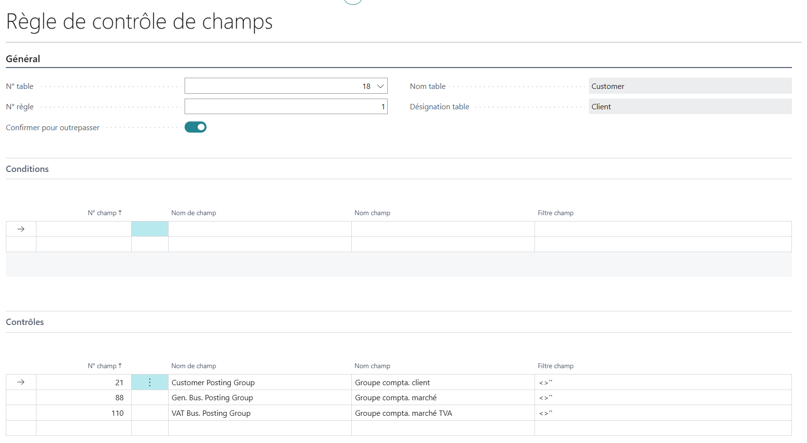
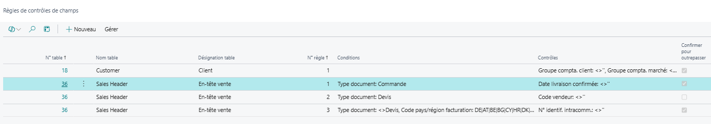
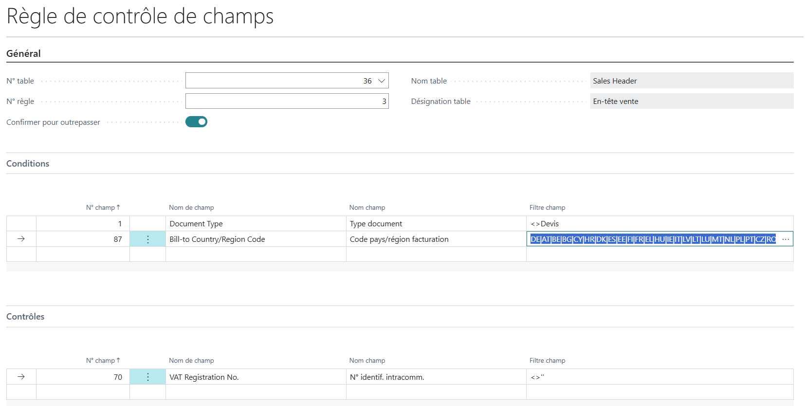

# Extension WanaCheck

Il est souvent utile de s'assurer que les champs nécessaires ont bien été complétés.

Cette extension vous permettra d'être automome pour des contrôles simples.

**Sommaire**

- [Configuration](#configuration)
- [Application](#application)
  - [Sur déblocage](#sur-déblocage)
  - [Sur **Lancer**](#sur-lancer)
  - [Sur **Valider** d'une feuille](#sur-valider-dune-feuille)
- [Principe](#principe)
- [Exemples](#exemples)
- [Administration](#administration)

## Configuration
WanaCheck permet de configurer des **Règles de contrôles de champs** composées de **Conditions** et de **Contrôles** pour n'importe quelle table. 

**Règles**

Plusieurs règles peuvent s'appliquer pour une même table.

**Conditions** et **Contrôles**

Dans un cas comme dans l'ordre, il s'agit de définir un ensemble de filtres comme vous le feriez pour les filtres habituels.
Des champs peuvent être ajoutés un à un ou par l'action **Ajouter champs** permettant une sélection multiple.

**Filtre champ**

Pour les champs en relation avec une table de référence, la valeur peut être sélectionnée dans la liste (Lookup).\
Cependant, ceci n'est pas applicable aux relations multi-tables (ex : **N°** de **Ligne vente** selon **Type**).

Pour les champs de **Type** *Option* ou *Enumération* (ex : **Type document**) la liste de valeurs est proposée.\
Il est préférable d'utiliser la valeur numérique (ex : 0:Devis, 1:Commande...) afin d'assurer la comptabilité dans toutes les langues. Si Business Central n'est utilisé qu'en français, vous pouvez toutefois utiliser les options (ex : Devis, Commande...).

**Confirmer pour outrepasser**

À l'exécution, l'extension évalue les règles configurées sur un enregistrement.

Si cette indicateur est coché, une confirmation de l'utilisateur est demandée lorsque les vérifications échouent. Dans l'affirmative, le traitement se poursuit.

**Activé**
Seules les règles actives sont appliquées.

Si lors de la fermeture de la page, la règle n'est pas active, une confirmation est proposée.

## Application

### Sur déblocage
Pour les éléments suivants : 
  * Compte général 
  * Client 
  * Fournisseur 
  * Article 
  * Resource 
  * Projet 
  
  Si une règle (ou plus) correspondante est active lors de leur création, ces mêmes éléments sont implicitement **Bloqué** lors de leur création afin que le déblocage soit une étape nécessaire.

### Sur **Lancer**
Pour les documents suivants : 
  * Document d'achat 
  * Document de vente 
  * Ordre d'assemblage
  * Ordre de transfert

Des règles peuvent être appliquées aux lignes comme à l'entête.

### Sur **Valider** d'une feuille

S'applique (quel que soit le type de modèle feuille) à : 
* Ligne feuille comptabilité 
* Ligne feuille article
* Ligne feuille projet
* Ligne feuille ressource

## Principe
Pour chacune des **Règles de contrôle de champs** de la table concernée : 
* Le filtre **Conditions** est appliqué à l'élément
  * Si ce dernier en fait partie, les **Contrôles** sont appliqués en appliquant les filtres correspondants à ce même élément.
    * S'il n'en fait pas partie, il n'est donc pas conforme, et dans ce cas : 
      * Si l'option **Confirmer pour outrepasser** est activée, ce n'est qu'une alerte ("Voulez-vous continuer ?" Oui/Non).
      * Dans le cas contraire, l'erreur doit être prise en compte.

## Exemples

Ici, les 3 champs définis en **Contrôles** s'appliquent à tous les clients (pas de **Conditions**) :

Parmi les règles applicables aux documents de vente (table **En-tête vente**), la première ne s'applique qu'aux commandes, la seconde ne concerne que les devis, 

**Remarques**
* Pour les commandes, la présence de la **Date de livraison** est ici contrôlée mais, à défaut, une simple confirmation permettra de passer outre.

* La dernière règle ci-dessus vérifie la présence du **N° identif. intracomm.** pour les ventes en Union Europénne, exception faite des devis (le **N° identif. intracomm.** peut ne pas être défini à ce stade) : \

* Le fitre est cependant limité à 250 caractères (ici suffisants pour : DE|AT|BE|BG|CY|HR|DK|ES|EE|FI|FR|EL|HU|IE|IT|LV|LT|LU|MT|NL|PL|PT|CZ|RO|SK|SI|SE).
* Les règles s'appliquent au sein de la même table. Ainsi par exemple, il n'est pas possible de définir une règle pour les lignes vente qui ne concernerait que celles ayant une valeur particulière en en-tête (sauf si celle-ci est héritée sur les lignes, comme pour "Type document" ou "Code devise" par exemple).

## Administration

**Ensembles d'autorisations**

* **WanaCheck** doit être accordé à tous les utilisateurs de ces règles.
* **WanaCheck_Setup** permet de les établir.
